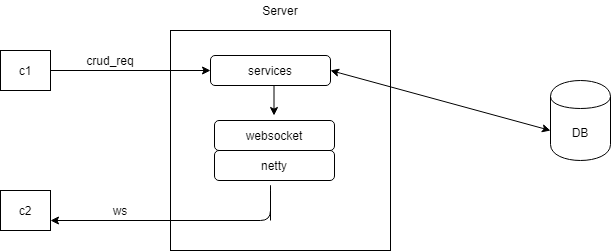

# 前后端分离模式下的数据同步解决方案

## 后端部分: 
#### springboot + websocket + netty

> 1. 双向心跳保活

###### References:
> - [Zinc](https://github.com/tylertreat/Zinc)
> - [FastFrameJar](https://github.com/YouAreOnlyOne/FastFrameJar/tree/master/MsgPush)

## 前端部分:
